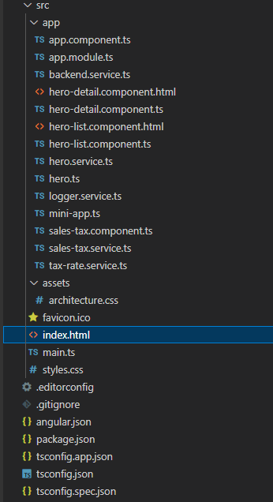

# Lesson 2.

## Contents

1. [Chapter II](#chapter-ii) \
   1.1.[Angular](#angular) \
   1.2 [Устройство фреймворка](#устройство-фреймворка) \
   1.3 [Angular cli](#angular-cli) \
   1.4 [Структура Angular приложения](#структура-angular-приложения) \
   1.5 [Сравнение с React](#сравнение-с-react)

## Chapter I

Сегодня мы познакомимся с фреймворком Angular. Рассмотрим его основные концепции и проведем аналогии с React.

### Angular

Angular - фреймворк для проектирования веб-приложений от Google, с открытым кодом на основе Typescript. Первая версия данного фреймворка была выпущена в 2010 году под названием AngularJS, на данный момент актуальной версией является 15. 

### Устройство фреймворка 

#### Компоненты

Angular приложения состоят из компонентов - обособленных элементов с логикой внутри. За создание angular компонента отвечает декоратор @Component.
Свойства, которые принимает декоратор:
Selector - название компонента
Template - HTML разметка или путь к файлу с разметкой.
Providers - список сервисов для данного компонента.
styles - путь или массив путей к css файлам.

Пример объявления компонента:
```
import { Component } from '@angular/core';
     
@Component({
    selector: 'my-app',
    template: `<label>Введите имя:</label>
                 <input [(ngModel)]="name" placeholder="name">
                 <h1>Добро пожаловать {{name}}!</h1>`
})
export class AppComponent { 
    name: "";
}
```

Каждый компонент имеет свой жизненный цикл (Component Lifecycle), в процессе которого вызываются ряд описывающих текущий этап методов (Angular Hooks): \
`-` OnChanges - устанавливаются или изменяются значения входных свойств класса компонента. \
`-` OnInit - устанавливаются "обычные" свойства; вызывается единожды вслед за первым вызовом OnChanges(). \
`-` DoCheck - происходит изменения свойства или вызывается какое-либо событие. \
`-` AfterContentInit - в шаблон включается контент, заключенный между тегами компонента. \
`-` AfterContentChecked - аналогичен DoCheck(), только используется для контента, заключенного между тегами компонента. \
`-` AfterViewInit - инициализируются компоненты, которые входят в шаблон текущего компонента. \
`-` AfterViewChecked - аналогичен DoCheck(), только используется для дочерних компонентов. \
`-` OnDestroy - компонент "умирает", т. е. удаляется из DOM-дерева. \

[Схема жизненных циклов](materials/life_cycles_angular_component.png)

Для передачи данных из одного Angular компонента в другой существует несколько способов:

`-` @Input() свойства. \
`-` @Output() свойства. \
`-` @ViewChild() свойства. \
`-` Сервис. \


#### Модули

Модули Angular NgModules отличаются от модулей JavaScript (ES2015) и дополняют их. NgModule объявляет контекст компиляции для набора компонентов, предназначенных для рабочего процесса. NgModule может связывать свои компоненты со смежным кодом, таким как сервисы, для формирования функциональных единиц.

Каждое приложение Angular имеет корневой модуль, условно называемый AppModule, который обеспечивает механизм загрузки, запускающий приложение. Приложение обычно содержит множество функциональных модулей.

Как и модули JavaScript, NgModules могут импортировать функциональность из других NgModules, а также позволяют экспортировать свою собственную функциональность и использовать ее другими модулями. Например, вы можете создать модуль для управления маршрутизацией в вашем приложении(модуль Router NgModule).
 чтобы использовать службу маршрутизатора в вашем приложении, вы импортируете модуль Router NgModule.

Организация кода в отдельные функциональные модули помогает управлять разработкой сложных приложений и проектировать их повторное использование. Кроме того, эта техника позволяет использовать преимущества ленивой загрузки - то есть загрузки модулей по требованию - для минимизации объема кода, который должен быть загружен при запуске.

Пример модуля маршрутизации:

```
const routes: Routes = [
    {
        path: 'profile-page',
        component: ProfilePageComponent
    },
];

@NgModule({
    imports: [RouterModule.forChild(routes)],
    providers: [ProfilePageResolver, ProfilePageGuard],
    exports: [RouterModule]
})
export class ProfilePageModule {}
```

#### Сервисы и DI(Dependency Injections)

Сервисы нужны для снабжения компонентов данными. Например, это могут быть HTTP запросы к серверу или функции которые преобразуют данные по заданному алгоритму.
Dependency Injection - широко распространенный паттерн проектирования, который позволяет создавать объект, использующий другие объекты. Ядро Angular имеет свою собственную реализацию паттерна Dependency Injection. Самый простой пример DI в Angular - это использованием компонентом сервиса, чаще всего для получения данных.
Все сервисы регистрируются Injector-ом, который является частью механизма DI в Angular. Причем в приложении может быть несколько injector-ов одновременно.

Пример сервиса: 

```
export class DataService {
  private data: Laptop[] = [
    { name: 'MacBookProM1Pro', price: 2000 },
    { name: 'MacBookProM1Max', price: 2500 },
    { name: 'MacBookAirM1', price: 1300 },
  ]
  getData(): Phone[] {
    return this.data
  }
  addData(name: string, price: number) {
    this.data.push(new Laptop(name, price))
  }
}
```

#### Темплейты и Директивы

Директивы предназначены для наделения компонента поведением(преобразование DOM). 
Шаблон объединяет HTML с разметкой Angular, которая может изменять элементы HTML перед их отображением. Директивы шаблона обеспечивают программную логику, а разметка привязки соединяет данные приложения и DOM. Существует два типа привязки данных:
Event binding
Property binding
Первый отвечает за привязку к события которые вызывает пользователь(нажатие клавиш или мыши), второй позволяет интерполировать значения, вычисленные из данных приложения, в HTML.

Пример компонента с темплейтом:

```
@Component({
  selector: 'app-root',
  template: `      
      <ng-template>
          <button (click)="login()">{{loginText}}</button>
          <button (click)="signUp()">{{signUpText}}</button>
      </ng-template>
  `})
  
export class AppComponent {
    loginText = 'Login';
    signUpText = 'Sign Up'; 
    lessons = ['Lesson 2', 'Lessons 22'];

    login() {
        console.log('Login');
    }

    signUp() {
        console.log('Sign Up');
    }
}
```
Наглядная схема взаимодействия структурных элементов в Angular: \
[Схема взаимодействия](materials/angular_relations.png)


### Angular cli
Angular CLI - это самый быстрый и удобный способ разработки Angular приложения. Angular CLI позволяет с легкостью выполнять следующие задачи:
ng build Компилирует приложение Angular в выходной каталог.
ng serve Собирает и обслуживает ваше приложение, перестраивая его при изменении файлов.
ng generate Генерирует или изменяет файлы на основе схемы.
ng test Выполняет модульные тесты для данного проекта.

https://github.com/angular/angular-cli

### Структура Angular приложения



Верхний уровень дериктории проекта будет содержать следующие файлы и папки: \

`-` .editorconfig Конфигурация для редакторов кода. \
`-` .gitignore Указывает намеренно неотслеживаемые файлы, которые Git должен игнорировать. \
`-` README.md Вводная документация для корневого приложения. \
`-` angular.json Параметры конфигурации CLI по умолчанию для всех проектов в рабочем пространстве, включая параметры конфигурации для инструментов сборки, обслуживания и тестирования, используемых CLI, таких как Karma и Protractor. \
`-` package.json Настраивает зависимости пакетов npm, которые доступны всем проектам в рабочем пространстве. \ 
`-` package-lock.json Предоставляет информацию о версии всех пакетов, установленных в node_modules клиентом npm.  Если вы используете клиент yarn, вместо этого файла будет yarn.lock.
`-` src/ Исходные файлы для проекта приложения корневого уровня. \
`-` node_modules/ Предоставляет пакеты npm всему рабочему пространству. Зависимости node_modules для всего рабочего пространства видны всем проектам. \
`-` tsconfig.json Базовая конфигурация TypeScript для проектов в рабочем пространстве. Все остальные файлы конфигурации наследуются от этого базового файла. \

По умолчанию команда CLI ng new my-app создает папку рабочего пространства с именем "my-app" и генерирует скелет нового приложения в папке src/ на верхнем уровне рабочего пространства. Вновь созданное приложение содержит исходные файлы для корневого модуля, с корневым компонентом и шаблоном: \
`-` app/app.component.ts Определяет логику для корневого компонента приложения, названного AppComponent. Представление, связанное с этим корневым компонентом, становится корнем иерархии представлений по мере добавления компонентов и сервисов в приложение. \
`-` app/app.component.html Определяет шаблон HTML, связанный с корневым компонентом AppComponent. \
`-` app/app.component.css Определяет базовую таблицу стилей CSS для корневого AppComponent. \
`-` app/app.component.spec.ts Определяет модульный тест для корневого AppComponent. \
`-` app/app.module.ts Определяет корневой модуль с именем AppModule, который указывает Angular, как собрать приложение. Изначально объявляет только AppComponent. По мере добавления других компонентов в приложение они должны быть объявлены здесь. 

[Ссылка на документацию](https://angular.io/guide/file-structure)


### Сравнение с React

`-` В отличие от React Angular предстовляет из себя полноценный фреймворк для разработки приложения. Следовательно имеет строгое представление о том как должно быть структурировано ваше приложение, а также имеет множество небольших встроенных библиотек, которые помогают создавать сложные приложения. \
`-` Язык разработки - Typescript. \
`-` Модель привязки данных в Angular является двунаправленной, что означает двусторонний поток данных между моделью и представлением. В отличие от ReactJS, Angular автоматически синхронизирует модель и представление, когда вы вносите изменения в состояние модели и/или пользовательский интерфейс. \
`-` Еще одной отличительной особенностью является то, что Angular взаимодействует с  обычным DOM, который, в отличие от виртуального DOM React, автоматически не определяет  изменения в файле, чтобы обновить вновь внесенные изменения. Вместо этого он обновляет всю структуру HTML каждый раз, когда вносится изменение. \ 
`-` Для большинства разработчиков является более тяжелым в освоении и изучении.
`-` В отличие от JSX, которые позволяет нам писать JS код в HTML разметке в реакте, в Angular темплейты разрабатываются на чистом HTML с использованием встроенных директив, также присутствует удобная интеграция с RxJS - библиотекой, которая использует наблюдаемые объекты для реактивного программирования.  
### Project_01


